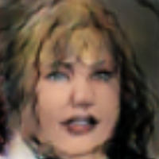

# Comic Face Generation using GANs
This project aims to generate comic-style face images using Generative Adversarial Networks (GANs). The GAN architecture used in this project is based on the DCGAN model.

## GAN (Generative Adversarial Networks)
[GAN](https://papers.nips.cc/paper/5423-generative-adversarial-nets.pdf) stands for Generative Adversarial Networks, which is a deep learning architecture consisting of two neural networks: a generator network and a discriminator network. The generator network generates synthetic data (such as images) while the discriminator network tries to distinguish between the real and synthetic data. The two networks are trained together in an adversarial manner, with the goal of the generator network generating synthetic data that is indistinguishable from the real data.

[DCGAN](https://arxiv.org/pdf/1511.06434.pdf) stands for Deep Convolutional Generative Adversarial Networks, which is a specific type of GAN architecture that uses convolutional neural networks (CNNs) in both the generator and discriminator networks. DCGANs have been shown to be very effective at generating high-quality synthetic images, particularly in the context of generating images of faces and other objects. They have become a popular architecture for generating synthetic images in various applications, including art, fashion, and gaming.

## Dataset
The dataset used for training the GAN model is the [face2comics](https://www.kaggle.com/datasets/defileroff/comic-faces-paired-synthetic) dataset, which contains over 20,000 face images. For this project, we only used comics images of the dataset that contains 10,000 images.

## Results
Here are some sample images generated by the GAN model after 50 epochs of training:

### My favorite generated comics:

As you can see, the model is able to generate comic-style face images.